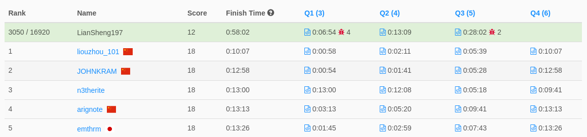

# Biweekly Contest 76 
> 2022-04-16 22:30 ~ 24:00 (UTC+8)  
> https://leetcode.com/contest/biweekly-contest-76/

**全部共有四題**
1. [Find Closest Number to Zero](./1.6060/readme.md)  
耗時約 6 分鐘。太急着提交，沒有在本機多試幾次，導致有 4 個錯誤提交。
2. [Number of Ways to Buy Pens and Pencils](./2.6061/readme.md)  
耗時約 7 分鐘
3. [Design an ATM Machine](./3.6062/readme.md)  
耗時約 15 分鐘
4. [Maximum Score of a Node Sequence](./4.6063/readme.md)  
未完成

（截自比賽結束後 162 分鐘，未來排名可能會有不同）

這次的前三題都很簡單，不到半小時就解決 :D  
然後第四題直接圖論，完全是我最最最陌生的部分  
雖然有嘗試建立該題的無向圖，但要解題的話，還有很長的路要走。

先這樣吧。明天(4/17)還有一個 Weekly Contest。