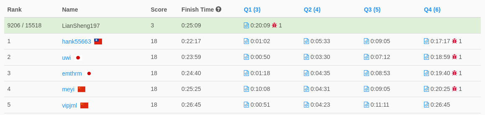

https://leetcode.com/contest/biweekly-contest-77/problems/minimum-average-difference/

2251 Start  
2307 TLE    
2309 TLE  
2347 TLE  
2400 Contest End
2507 AC - 因爲是結算後才答對，直接歸檔  # Weekly Contest 289  
> 2022-04-17 10:30 ~ 12:00 (UTC+8)  
> https://leetcode.com/contest/weekly-contest-289/

**全部共有四題**
1. [Calculate Digit Sum of a String](./1.md)  
耗時約 17 分鐘
2. [Minimum Rounds to Complete All Tasks](./2.md)  
耗時約 13 分鐘
3. [Maximum Trailing Zeros in a Cornered Path](./3.md)  
未完成。~~以前寫老鼠走迷宮的 PTSD 都出來了~~  
可以的話，我希望可以儘早把它解決（感覺只差臨門一腳）
4. [Longest Path With Different Adjacent Characters](./4.md)  
未完成

感覺單週的題目似乎都比較難（？  
這次解了前兩題，拿了 7 分。（正常發揮？）  

（截自比賽結束後 30 分鐘，未來排名可能會有不同）

先休息一下，晚點再把第三題收了。
