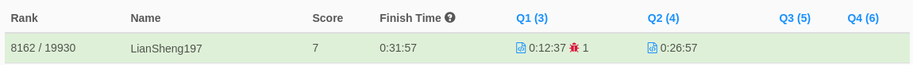
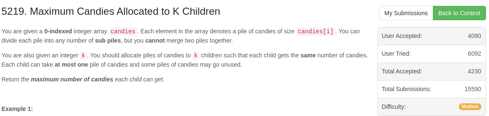
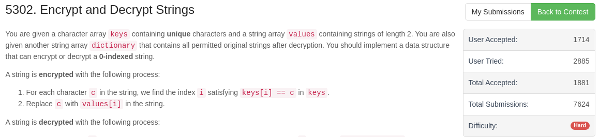

# Weekly Contest 287 
> 2022-04-03 10:30 ~ 12:00 (UTC+8)  
> https://leetcode.com/contest/weekly-contest-287/

第一次參加 Contest。

10:30 準時進入，然後就看到 `ERROR 1200`，原因是太多人同時請求了。大概等到 10:31 才正式開始。  

**全部共有四題**
1. [Minimum Number of Operations to Convert Time](1.6055/readme.md)  
耗時約 13 分鐘
2. [Find Players With Zero or One Losses](2.5235/readme.md)  
耗時約 14 分鐘
3. [Maximum Candies Allocated to K Children](3.5219/readme.md)  
未完成
4. [Encrypt and Decrypt Strings](4.5302/readme.md)  
未完成

第一題是 Easy，等我寫完時世界前十名已經出爐了@_@  
雖說我知道他們都很快，但是未免也太快了點

第三題的測資包含超大陣列，卡在 TLE 過不去。  
其實我也知道我的寫法很燒時間，但我一時間真的想不到要怎麽改善流程。

只好用剩餘時間趕緊把第四題的題目抄一抄。  
（不過看了一下，我想我應該也沒能力在 90 分鐘內解出）

我想我短期內還是別碰 Contest 好了，連 Medium 都沒能力通過，那表示基礎功遠遠不足。

### 最後排名： 8162 / 19930

***

### 最後一分鐘的截圖
  
有 4080 人通關。

  
有 1714 人通關。

Contest 結束後才發現原來各個題目的通關人次等成績都還能看到，看來是白截圖了XD
