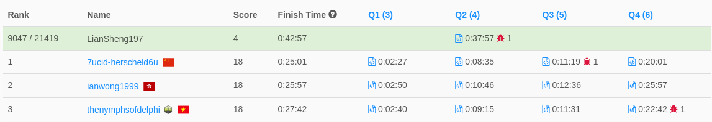

# Weekly Contest 288 
> 2022-04-10 10:30 ~ 12:00 (UTC+8)  
> https://leetcode.com/contest/weekly-contest-288/

每次剛開放就一定會看到 `ERROR 1200` XDD

**全部共有四題**
1. [Largest Number After Digit Swaps by Parity](1.6037/readme.md)  
寫到一半發現卡關，跳題，未完成
2. [Minimize Result by Adding Parentheses to Expression](2.6038/readme.md)  
耗時約 19 分鐘
3. [Maximum Product After K Increments](3.6039/readme.md)  
未完成，但感覺就差某個邏輯錯誤QQ
4. [Maximum Total Beauty of the Gardens](4.6040/readme.md)  
未完成

有夠難！  
這次只有解出第 2 題，拿到 4 分。  

但這不完全是我的問題，看排行榜就知道了。  

（截自比賽結束後 15 分鐘，未來排名可能會有不同）

我記得上週的競賽，前三名貌似都是 10 分鐘以內搞定 4 題。  
這次直接暴漲到 25 分鐘。

究竟是上週太簡單呢？還是這週太難呢？

先這樣吧。今天暫時不想再看到這四題，以後再回來補。
