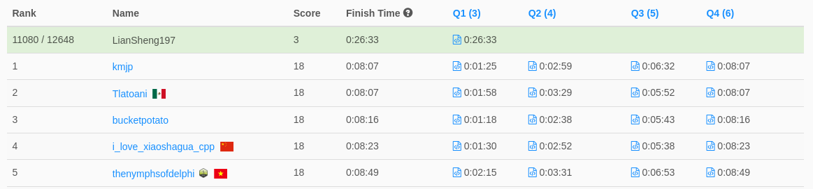

# Weekly Contest 291  
> 2022-05-01 10:30 ~ 12:00 (UTC+8)  
> https://leetcode.com/contest/weekly-contest-291/

**全部共有四題**
1. [Remove Digit From Number to Maximize Result](./1.md)  
耗時約 13 分鐘
2. [Minimum Consecutive Cards to Pick Up](./2.md)  
卡在 TLE 過不去...
3. [K Divisible Elements Subarrays](./3.md)  
未完成
4. [Total Appeal of A String](./4.md)  
未完成

這周根本翻車，連續兩場 Contest 都只拿 3 分。  
看來連續數天的出差讓我變笨了...

（截自比賽結束後 2 分鐘，未來排名可能會有不同）

現在我只想睡覺。