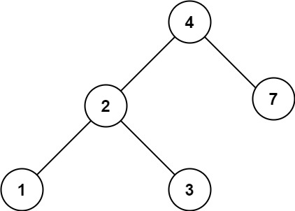

# 700. Search in a Binary Search Tree

You are given the `root` of a binary search tree (BST) and an integer `val`.

Find the node in the BST that the node's value equals `val` and return the subtree rooted with that node. If such a node does not exist, return `null`.

 

**Example 1:**  
  
```
Input: root = [4,2,7,1,3], val = 2
Output: [2,1,3]
```

**Example 2:**  
  
```
Input: root = [4,2,7,1,3], val = 5
Output: []
```

**Constraints:**
* The number of nodes in the tree is in the range `[1, 5000]`.
* `1 <= Node.val <= 10^7`
* `root` is a binary search tree.
* `1 <= val <= 10^7`


***
看起來是 Easy 的題目...  
正好前兩天太忙都斷掉了，來寫一下吧。


> [solution1.js](solution1.js)
> * 時間複雜度：`O(logn) <= O(h) <= O(n)` （其中 h 是 bst 的深度，n 是節點數）
> * 空間複雜度：`O(n)`
> * 提交成績：`75ms (95%), 49.9MB (15%)`
> * 提交日期：`2022-04-14`

結果寫本機測資花的時間與心力遠遠比題目本身還多...
寫到一半才發現我建立的樹只是一般樹，而不是二元搜尋樹，笑死  
果然我對一堆節點這種東西還不是很掌握呢。

