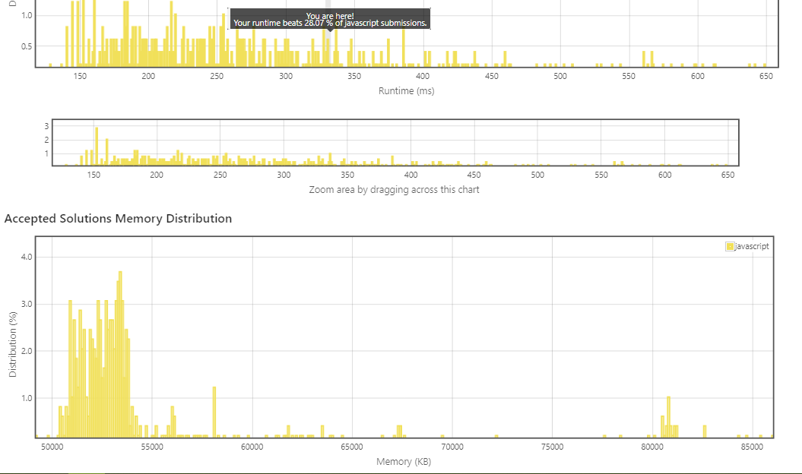

# 705. Design HashSet

Design a HashSet without using any built-in hash table libraries.

Implement `MyHashSet` class:
* `void add(key)` Inserts the value `key` into the HashSet.
* `bool contains(key)` Returns whether the value `key` exists in the HashSet or not.
* `void remove(key)` Removes the value `key` in the HashSet. If `key` does not exist in the HashSet, do nothing.
 

**Example 1:**
```
Input
["MyHashSet", "add", "add", "contains", "contains", "add", "contains", "remove", "contains"]
[[], [1], [2], [1], [3], [2], [2], [2], [2]]
Output
[null, null, null, true, false, null, true, null, false]

Explanation
MyHashSet myHashSet = new MyHashSet();
myHashSet.add(1);      // set = [1]
myHashSet.add(2);      // set = [1, 2]
myHashSet.contains(1); // return True
myHashSet.contains(3); // return False, (not found)
myHashSet.add(2);      // set = [1, 2]
myHashSet.contains(2); // return True
myHashSet.remove(2);   // set = [1]
myHashSet.contains(2); // return False, (already removed)
```

**Constraints:**
* `0 <= key <= 106`
* At most `10^4` calls will be made to `add`, `remove`, and `contains`.

----
相當簡單的一道題目。

繼前幾天連續的 tree, linked list 轟炸後，這題真的是毫無難度可言。

[solution1.js](solution1.js)
* 時間複雜度：`O(n)`
* 空間複雜度：`O(n)`
* 提交成績：`331ms (28%), 48.9MB (100%)` (!?)
* 提交日期：`2022-04-21`


記憶體用量超過 100% 的人!?  
厲害了，我真的第一次看到這種結果。 

https://leetcode.com/submissions/detail/684504868/

有圖有真相：  
  


居然連標示位置都沒有標示出來XD

