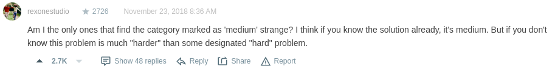
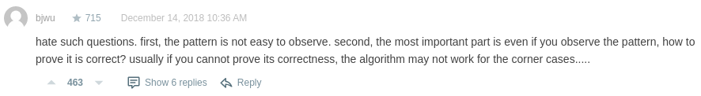
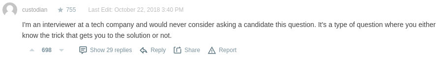
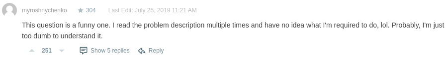
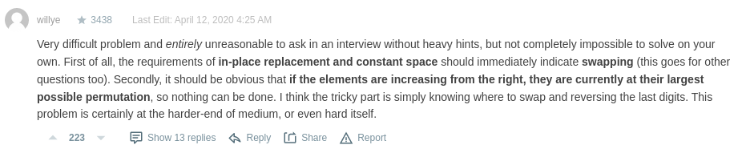

# 31. Next Permutation

A **permutation** of an array of integers is an arrangement of its members into a sequence or linear order.

* For example, for `arr = [1,2,3]`, the following are considered permutations of `arr: [1,2,3]`, `[1,3,2]`, `[3,1,2]`, `[2,3,1]`.


The **next permutation** of an array of integers is the next lexicographically greater permutation of its integer. More formally, if all the permutations of the array are sorted in one container according to their lexicographical order, then the **next permutation** of that array is the permutation that follows it in the sorted container. If such arrangement is not possible, the array must be rearranged as the lowest possible order (i.e., sorted in ascending order).

For example, the next permutation of `arr = [1,2,3]` is `[1,3,2]`.
Similarly, the next permutation of `arr = [2,3,1]` is `[3,1,2]`.
While the next permutation of `arr = [3,2,1]` is `[1,2,3]` because `[3,2,1]` does not have a lexicographical larger rearrangement.

Given an array of integers `nums`, find the next permutation of `nums`.

The replacement must be **in place** and use only constant extra memory.

 

**Example 1:**
```
Input: nums = [1,2,3]
Output: [1,3,2]
```

**Example 2:**
```
Input: nums = [3,2,1]
Output: [1,2,3]
```

**Example 3:**
```
Input: nums = [1,1,5]
Output: [1,5,1]
```

**Constraints:**
* `1 <= nums.length <= 100`
* `0 <= nums[i] <= 100`


***
### Note
拜讀前人留下的討論文，這才終於摸清楚題目要幹嘛= =  
爲了理解這題，燒了我不少腦細胞。

[solution1.js](solution1.js)
* 時間複雜度：`O(n)`
* 提交時成績：`56ms (99%), 43MB (46%)`
* 提交日期：`2022-04-03`


這題沒什麼特別的想法，除了開頭完全看不懂題目之外，沒太大問題。  
但爲了方便理解，原始碼那邊有滿滿的註解，想看的話就去那邊看吧。

***
**補充**  
在解法底下的留言看到整片罵聲，原來不完全是我英文爛的問題。

  
> 只有我覺得這標記爲 `Medium` 很奇怪嗎？  
> 我覺得如果你已經知道解題方案的話，那確實是中等。  
> 但如果你不知道這個問題，那麼這題甚至比某些標記 `Hard` 的題目還難。

  
> 討厭這種問題。  
> 首先，規律不易觀察；  
> 再者，就算你觀察到規律，那你要怎麽證明它是正確的？  
> 通常狀況下，如果你不能驗證其正確性，那該演算法（指解題人寫的程式）很可能會在極端狀況下失靈。


> 我是一家科技公司的面試官，從來不會問這種問題。  
> 這是一種你如果知道技巧就會做的問題，但如果你不知道，那就肯定不會。


> 這個問題很有趣。  
> 我反覆多次閱讀這個問題，但我不知道我要做什麼，笑死。  
> 可能是我太笨了，看不懂。


> 若沒有大量提示的話，在面試的情況下將是**非常困難且完全不合理**的問題。  
> （剩下在討論題目，恕略）
