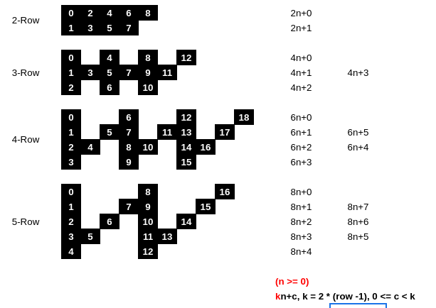

# 6. Zigzag Conversion

The string `"PAYPALISHIRING"` is written in a zigzag pattern on a given number of rows like this: (you may want to display this pattern in a fixed font for better legibility)

```
P   A   H   N
A P L S I I G
Y   I   R
```

And then read line by line: `"PAHNAPLSIIGYIR"`

Write the code that will take a string and make this conversion given a number of rows:

```
string convert(string s, int numRows);
```

**Example 1:**
```
Input: s = "PAYPALISHIRING", numRows = 3
Output: "PAHNAPLSIIGYIR"
```

**Example 2:**
```
Input: s = "PAYPALISHIRING", numRows = 4
Output: "PINALSIGYAHRPI"
Explanation:
P     I    N
A   L S  I G
Y A   H R
P     I
```

**Example 3:**
```
Input: s = "A", numRows = 1
Output: "A"
```

**Constraints:**
* `1 <= s.length <= 1000`
* `s` consists of English letters (lower-case and upper-case), `','` and `'.'`.
* `1 <= numRows <= 1000`


***
### Note
「這都什麼怪題目RRRR」  
雖說第一印象就像上面那樣，不過拿起紙筆寫過一次後就覺得其實挺簡單的 :D

[solution1.js](solution1.js)
* 時間複雜度：`O(n)` （雖然看起來有兩層迴圈，但實際上呼叫次數等同字串長度）
* 提交時消耗：`115ms, 47MB`


這次的程式碼看起來就不是這麼好懂了，主要是這題的規律需要自己去推。  
規律看起來大概像這樣：  


總之最後就是得出一個 `kn+c` 的公式，再根據三種情況（首列、末列、中間列）把它變成程式而已。  
整體來說並不難。